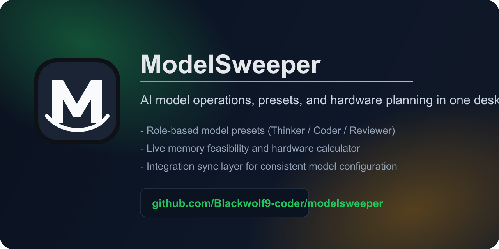

# ModelSweeper
[](https://github.com/Blackwolf9-coder/modelsweeper/actions/workflows/ci.yml)
[](LICENSE)
[](https://github.com/Blackwolf9-coder/modelsweeper/releases)



ModelSweeper is a desktop command center for AI model workflows.
It helps you choose the right models, validate memory fit before runtime, and keep role-based presets synchronized across tools.

## Why ModelSweeper
- Reduce trial-and-error before inference starts
- Switch role presets quickly (`Thinker`, `Coder`, `Reviewer`)
- Estimate RAM/VRAM fit with practical hardware inputs
- Keep local and cloud-oriented workflows in one clean UI

## Live Links
- Website: [blackwolf9-coder.github.io/modelsweeper](https://blackwolf9-coder.github.io/modelsweeper/)
- Releases: [github.com/Blackwolf9-coder/modelsweeper/releases](https://github.com/Blackwolf9-coder/modelsweeper/releases)
- Launch Plan: [LAUNCH_PLAN.md](LAUNCH_PLAN.md)
- Campaign Kit (EN): [CAMPAIGN_KIT.md](CAMPAIGN_KIT.md)
- Campaign Kit (AR): [CAMPAIGN_KIT_AR.md](CAMPAIGN_KIT_AR.md)
- Product Hunt Pack: [PRODUCT_HUNT_READY.md](PRODUCT_HUNT_READY.md)
- v0.2.0 Roadmap: [ROADMAP_v0.2.0.md](ROADMAP_v0.2.0.md)

## Core Features
- Role-based presets with instant activation
- Model catalog with one-click role assignment
- Live system RAM tracking vs selected preset load
- Hardware Calculator with slider-based controls:
  - Model size (B params)
  - Context length (tokens)
  - System RAM (GB)
  - VRAM per GPU (GB)
- Integration settings export for external clients

## Product Areas
- `Dashboard`: machine RAM state and preset load warnings
- `Models`: manage installed models and assign operational roles
- `Preset Builder`: compose simultaneous/sequential execution profiles
- `Hardware Calculator`: estimate RAM, VRAM, and deployment fit
- `Integrations`: map active preset settings to tool integrations

## Stack
- Electron
- React + TypeScript
- Zustand
- Vite
- Tailwind CSS

## Getting Started
### Requirements
- Node.js 18+
- npm 9+

### Install
```bash
npm install
```

### Run (Dev)
```bash
npm run dev
```

### Validate
```bash
npm run typecheck
npm run lint
```

### Build
```bash
npm run build
```

### Package Desktop App
```bash
npm run dist
```

## Contributing
See [CONTRIBUTING.md](CONTRIBUTING.md).

## Security
See [SECURITY.md](SECURITY.md).

## License
MIT
